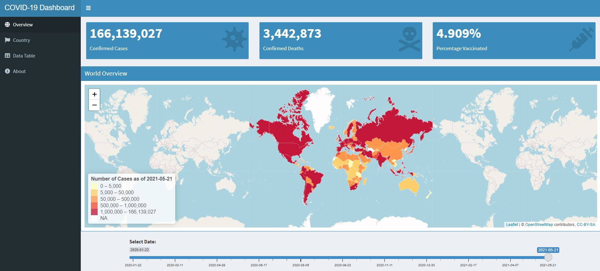

## Introduction

* During this pandemic, most of the reports which we get are often through the media. However, these reports tend to be inaccurate and inconsistent as they tend to cherry-pick the statistics and graphs to generate attention grabbing headlines. 

* To get an accurate and reliable picture of the current impact of COVID-19, we should pull the data directly from a reliable source and analyze it. 

* For this project, we will obtain data directly from [Our World in Data](https://ourworldindata.org/coronavirus-source-data) which relies on data from [Johns Hopkins University](https://coronavirus.jhu.edu/map.html) and visualize them through a Shiny App. 

* The Shiny App can be found at this link: (https://dillonchewwx.shinyapps.io/coursera-ddp-project2/) and the next few slides will explain how the dashboard works.

---
## Dashboard Outline



---
## Dashboard Description

* The **Overview** tab provides a global outlook with key figures and map/graph visualizations. There is also a slider bar included to view the data for certain dates. The `shinydashboard` package was used to build the UI and the map was rendered using `Leaflet`. 

* The **Country** tab allows the user to select the country of interest and shows the key statistics and graphs. The plots are rendered with `Plotly` and thus are interactive. 

* The full data table for generating the visualizations can be explored in the **Data Table** tab. The `DT` package was used to generate the HTML table.

* The **About** tab contains information about the project and the developer.

---
## Plot examples

* Line graphs highlighting the global trend from when the pandemic started are shown here.
```{r Plot Examples, echo=FALSE, message=FALSE, warning=FALSE, out.width="50%"}
source("../global.R")
global_plot_cases(world_data %>%
                      filter(date<=today()-2))
global_plot_deaths(world_data %>%
                      filter(date<=today()-2))
```